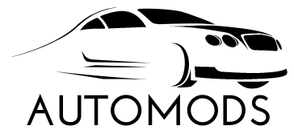

<p align="center">
  <a href="https://github.com/costajvsc/automods">
    
  </a>

  <h3 align="center">Automods</h3>

  <p align="center">
    API .NET + Angular.JS.
    <br />
    <a href="https://github.com/costajvsc/automods/issues">Report Bug</a>
    ·
    <a href="https://github.com/costajvsc/automods/issues">Request Feature</a>
  </p>
</p>

<details open="open">
  <summary>Tabela de conteúdos</summary>
  <ol>
    <li>
      <a href="#sobre-o-projeto">Sobre o projeto</a>
      <ul>
        <li><a href="#tecnologias">Tecnologias</a></li>
      </ul>
    </li>
    <li>
      <a href="#getting-started">Getting Started</a>
      <ul>
        <li><a href="#back-end">Back-end</a></li>
        <li><a href="#front-end">Front-end</a></li>
      </ul>
    </li>
    <li><a href="#features">Features</a></li>
    <li><a href="#license">Licença</a></li>
    <li><a href="#Contribuição">Contribuição</a></li>
    <li><a href="#contato">Fale comigo</a></li>
    <li><a href="#conhecimentos">Conhecimentos adquiridos</a></li>
  </ol>
</details>

## Sobre o projeto

Automods é um projeto utilizado como teste sobre meus conhecimentos em desenvolvimento de softwares para  web. O intuito princial é demonstrar minhas habilidades com a construção de api back-end e a integração com o front-end permitindo a realização de pequenos CRUDs de entidades relacionada entre sí. Para o escopo do automods ficou definido três entidades: `Carro`, `Marca` e `Categoria`, sendo que a primeira é a entidade dependente e as demais são entidades fortes.

### Tecnologias

O Automods foi construido utilizando as seguintes tecnologias: 
* [.Net 5](https://dotnet.microsoft.com/download/dotnet/5.0)
* [Angular](https://angular.io)
* [Bootstrap](https://getbootstrap.com)

## Getting Started

Certifique-se de que os SDKs das tecnologias utilizadas estejam devidamentes configuradas em seu ambiente.

1. Clone o repositório git:
   ```sh
    git clone https://github.com/costajvsc/automods.git
   ```

### Back-end
Após acessar a pasta `api` execute os seguintes passos:

1. Crie o arquivo `appsettings.json` e configure a string de conexão para acesso ao banco de dado

    ```json
    "AllowedHosts": "*",
    "ConnectionStrings": {
        "connection": "Server=localhost;database=automods;user=SA;password=" 
    }
    ```

2. Construa a base de dados com as migrations
   ```sh
    dotnet ef database update
   ```
3. Inicie o serviço da API
   ```sh
    dotnet run
   ```

### Front-end
Após acessar a pasta `web` execute os seguintes passos:

1. Instale as dependências do projeto
    ```sh
        npm install
    ```

2. Inicie o serviço para servir a aplicação em Angular
    ```sh
        ng serve -o
    ```

## Features

### Back-end
- [X] CRUD Carros
- [X] CRUD Marcas
- [X] CRUD Categorias
- [ ] Filtros e paginação 
- [ ] HATEOAS API
- [ ] Testes unitários
- [ ] Docker file (deploy)

### Front-end 
- [X] Listagem de Carros, Marcas e Categorias
- [ ] Métodos `CREATE`, `UPDATE` e `DELETE` implementados.
- [ ] Utilização de `alerts` para notificação da execução das funcionalidades.

## Licença

Esse software está sob licença MIT.

## Contribuição

Contribuições são **muito bem vindas** ao projeto. Caso tenha interesse em criar uma nova funcionalidade ou melhoria:

1. Crie um fork do projeto
2. Crie uma branch para sua feature (`git checkout -b feature/AmazingFeature`)
3. Commite suas alterações (`git commit -m 'Add some AmazingFeature'`)
4. Push sua branch (`git push origin feature/AmazingFeature`)
5. Abra um Pull Request

## Contato

João Victor - [LinkedIn](https://www.linkedin.com/in/victor-costa-jvsc/) - costa.jvsc@gmail.com

Github: [https://github.com/costajvsc/automods](https://github.com/costajvsc/automods)

## Conhecimentos

* Arquitetura MVC 
* Utilização de `migrations` (Code-first)
* Implementação de interfaces utilizando o `Angular`
